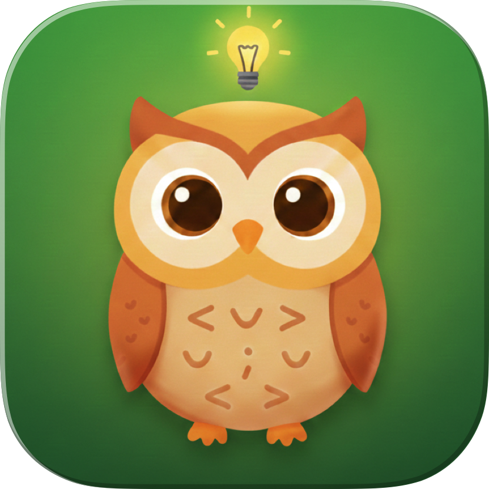

# CCLangTutor

<p align="center">
  
  <br>
  Claude Code のプロンプトの英文法を自動的に添削する macOS アプリ
</p>

[English](README.md) | 日本語

## インストール

1. [Releases](https://github.com/Saqoosha/CCLangTutor/releases) から最新の `.dmg` をダウンロード
2. DMG を開いて `CCLangTutor.app` を Applications にドラッグ
3. アプリを一度起動して hook を登録

## 設定

### API キー

1. CCLangTutor.app を開く
2. Settings (⌘,) を開く
3. 使用するプロバイダー (Claude, Gemini, OpenAI) の API キーを入力
4. "Save" をクリック

API キーは macOS Keychain に安全に保存されます。

### 応答言語

添削の説明やチャットの応答言語を選択できます：

- English（デフォルト）
- 日本語
- Español（スペイン語）
- Français（フランス語）
- Deutsch（ドイツ語）
- 中文（中国語）
- 한국어（韓国語）

注意：添削対象の言語は常に英語です。この設定は説明文の言語にのみ影響します。

### Claude Code Hook

Claude Code の設定ファイル (`~/.claude/settings.json`) に以下を追加：

```json
{
  "hooks": {
    "UserPromptSubmit": [
      {
        "hooks": [
          {
            "type": "command",
            "command": "/Applications/CCLangTutor.app/Contents/MacOS/english-teacher"
          }
        ]
      }
    ]
  }
}
```

## 使い方

1. CCLangTutor.app を起動（バックグラウンドで動作）
2. Claude Code を普通に使う
3. プロンプトが自動的に解析され、添削結果がアプリに表示される
4. 添削をクリックすると詳細を確認でき、質問もできる

### スラッシュコマンド

スラッシュコマンド（例：`/commit message here`）を使用する場合、コマンド自体ではなく引数部分のみが添削されます。

## 制限事項

**添削されるもの：**
- メイン入力欄に入力した通常のプロンプト（Claude がアイドル状態のとき）
- スラッシュコマンドの引数（例：`/commit fix the bug` → "fix the bug" が添削される）

**添削されないもの：**
- Claude Code が処理中に送信したメッセージ（割り込みメッセージ）
- `AskUserQuestion` ツールへの回答（"Other" のカスタムテキストを含む）
- 定義済みオプションの選択（そもそもユーザーが書いたテキストではない）

これは Claude Code の hook システムの制限です。`UserPromptSubmit` hook は通常のプロンプト送信時にのみ発火します。

## プライバシー

すべてのプロンプトは、文法添削のために選択した LLM プロバイダー（Claude, Gemini, OpenAI）に送信されます。外部サービスへのプロンプト送信に懸念がある場合は、このアプリを使用しないでください。

添削履歴は `~/Library/Application Support/CCLangTutor/` にローカル保存されます。

---

## 開発

### アーキテクチャ

```
User prompt → Claude Code Hook (UserPromptSubmit)
                    ↓
            english-teacher CLI
                    ↓
            pending.json (stored)
                    ↓
            CCLangTutor.app (processes)
                    ↓
            Claude API (Haiku) → corrections.json
                    ↓
            SwiftUI displays results
```

### 必要要件

- macOS 14.0+
- Xcode 16.0+
- [XcodeGen](https://github.com/yonaskolb/XcodeGen)

### ソースからビルド

```bash
git clone https://github.com/Saqoosha/CCLangTutor.git
cd CCLangTutor
./scripts/build.sh Release

# アプリの場所:
# build/DerivedData/Build/Products/Release/CCLangTutor.app
```

### ビルドコマンド

```bash
./scripts/build.sh Debug      # デバッグビルド
./scripts/build.sh Release    # リリースビルド
./scripts/package_dmg.sh      # DMG パッケージ作成（公証含む）
./scripts/release.sh 1.0.0    # 新バージョンリリース
```

### プロジェクト構成

```
Sources/
├── CCLangTutor/          # メインアプリ (SwiftUI)
├── CCLangTutorCore/      # 共有モデル
└── english-teacher/      # CLI hook
```

## ライセンス

MIT
